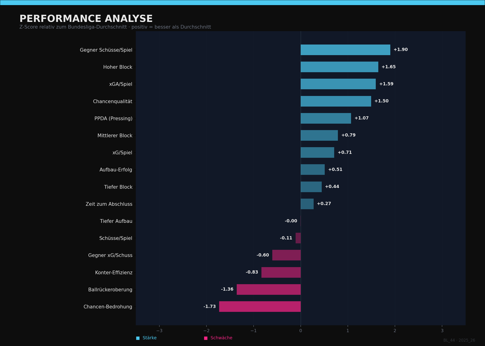
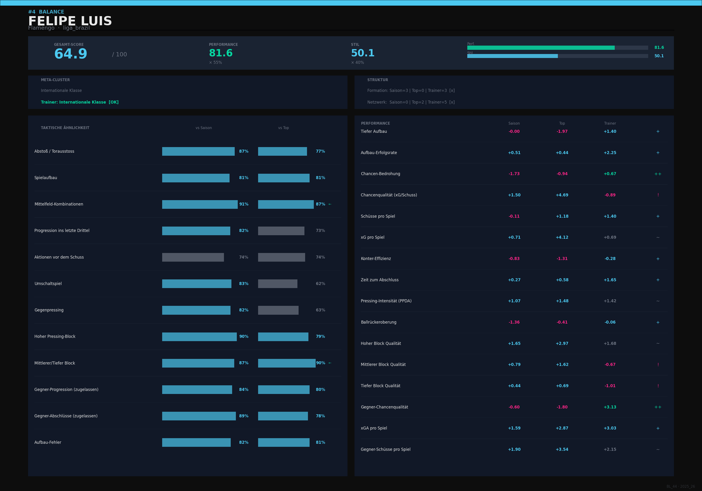

# ⚽ Football Coaching Analytics

Ein datengetriebenes Trainer-Matching-System, das vereinslose Trainer mit Vereinen anhand von taktischer Stilähnlichkeit und Performance-Potenzial vergleicht.

## Was macht das System?

Für einen gegebenen Verein identifiziert das System passende Trainer aus einem Pool vereinsloser Kandidaten — basierend auf Event-Level-Daten aus vier europäischen Ligen (Bundesliga, 2. Bundesliga, Premier League, La Liga).

Das System liefert drei unterschiedliche Rankings:

- **Fortführer** — Trainer, die den bisherigen Spielstil des Vereins am besten fortführen können
- **Erneuerer** — Trainer mit der höchsten erwarteten Performance-Verbesserung, unabhängig vom Stil
- **Balance** — bester Kompromiss aus beidem

## Methodik

**Sequenzanalyse:** Jede Ballbesitzphase wird in zwölf taktische Kategorien zerlegt (Aufbau, Progression, Gegenpressing, Umschaltspiel u. a.). Pro Kategorie werden Sequenzmuster per KMeans-Clustering gruppiert und gegen den Liga-Durchschnitt als Z-Score normiert.

**Top-Fenster-Konzept:** Statt den gesamten Saisonverlauf zu betrachten, identifiziert das System automatisch das 7-Spiele-Fenster mit der höchsten erwarteten Punkteausbeute (Poisson-xPts) — also die stärkste Phase eines Vereins. Trainer werden gegen dieses Top-Fenster verglichen, nicht gegen den Saisondurchschnitt.

**Eigenes xG-Modell:** Ein selbst trainiertes neuronales Netz bewertet jeden Torschuss anhand von Position, Winkel, Sequenzkontext und Drucksituation.

**Meta-Cluster:** Vereine und Trainer werden zusätzlich in vier übergeordnete taktische Familien eingeteilt, basierend ausschließlich auf den Z-Scores der zwölf Sequenzmuster. Das Ergebnis bildet die reale Ligahierarchie erstaunlich präzise ab — der FC Bayern München landet als einziges Team in einem eigenen Top-Cluster ("Elite"), klar getrennt von den übrigen internationalen Spitzenteams. Das bestätigt, dass die zugrunde liegenden taktischen Muster tatsächliche Qualitäts- und Stilunterschiede zwischen Vereinen abbilden, statt nur Rauschen zu clustern.

## Mehr als Trainer-Matching: Taktische Team- und Gegneranalyse

Die zugrunde liegende Pipeline ist nicht auf Trainersuche beschränkt. Da jedes Team ohnehin vollständig in zwölf taktischen Dimensionen profiliert wird, lässt sich das System direkt für die taktische Analyse einzelner Mannschaften nutzen — inklusive Gegneranalyse vor einem Spiel:

- **Stärken-/Schwächen-Profil** eines Vereins über alle Spielphasen hinweg (`vis_team.py`)
- **Visualisierung dominanter Sequenzmuster** auf dem Spielfeld, eingefärbt nach Cluster, mit Z-Score-Einordnung gegenüber dem Liga-Durchschnitt
- **Gegner-Profile** (zugelassene Progression, zugelassene Abschlüsse) zeigen, wie ein Gegner typischerweise bespielt wird
- **Formation- und Passnetzwerk-Cluster** ordnen den strukturellen Spielstil eines Teams ein

Damit eignet sich das System sowohl für die Vorbereitung auf einen konkreten Gegner als auch für eine allgemeine taktische Einordnung eines Vereins über eine Saison.

## Tech Stack

- **Python** — pandas, numpy, scikit-learn
- **PyTorch** — eigenes xG-Modell (Feedforward Neural Network)
- **Matplotlib / mplsoccer** — Visualisierungen
- **Selenium** — Event-Daten-Scraping

## Beispiel-Output

Pro Trainer wird eine vollständige taktische und statistische Analyse erstellt:




## Pipeline

```
scraping/        → Event-Daten von Spielen und Trainerstationen
scripts/
  ├── processing.py              → Datenaufbereitung
  ├── build_profiles.py          → Team-Profile (Saison)
  ├── build_top_profiles.py      → Top-Fenster-Profile
  ├── build_trainer_profiles.py  → Trainer-Profile
  ├── matching.py                → Ranking-Engine
  ├── vis_team.py                → Taktische Visualisierungen
  └── vis_matching.py            → Matching-Infografiken
```

## Über das Projekt

Eigenständig entwickelt im Rahmen meines VWL-Masterstudiums an der Universität Freiburg, mit dem Ziel, in die Fußball-Analytics-Branche einzusteigen. Datenbasis: über 600 Spiele aus vier Ligen, 65+ vereinslose Trainer.

---

**Kontakt:** [LinkedIn](https://www.linkedin.com/in/adrian-friedrich-4a318141b/) · [E-Mail](mailto:Adrianfriedrich12@gmail.com)
